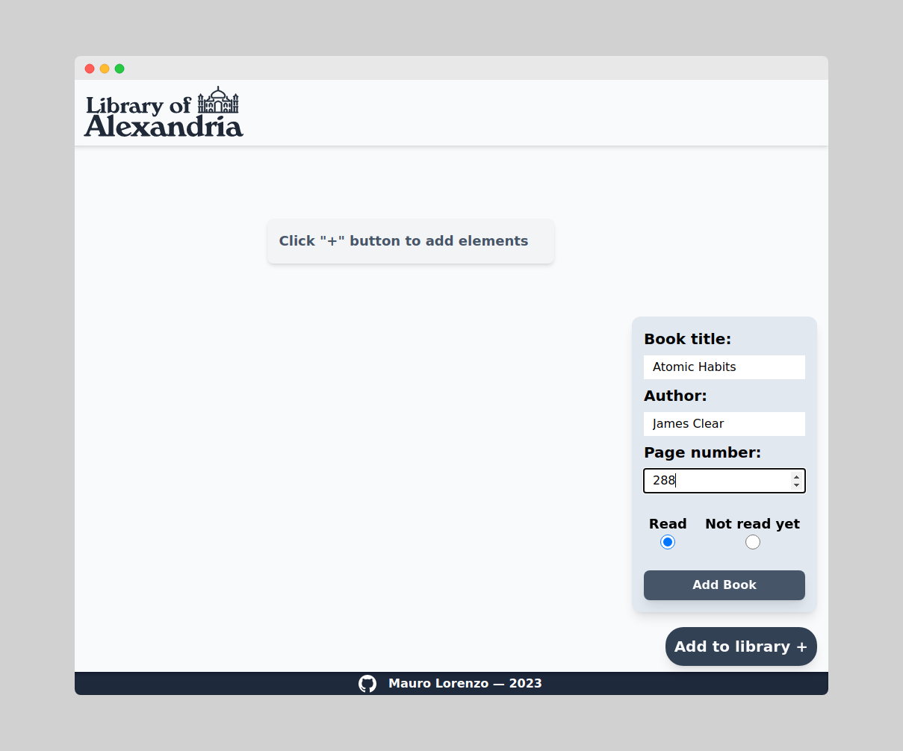
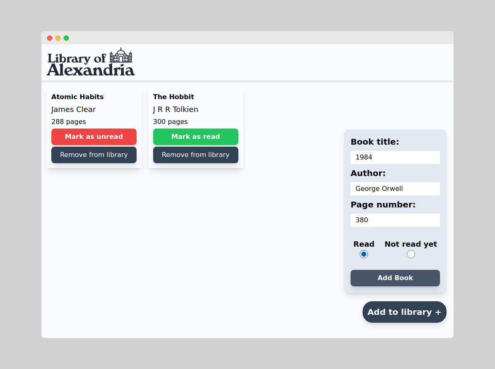

# Library
Digital library project, Library of Alexandria

Part of the Odin Project [Javascript Course](https://www.theodinproject.com/lessons/node-path-javascript-library)

## Features
- Live preview [HERE](https://mlorenzm.github.io/library/)
- Option to add books to library, remove them and change read status (toggle between read/unread)
- CSS done via Tailwnd CSS 
- HTML form validation

## Screenshots

## Known Limitations

- Grid layout is currently only 4x4
- Not the best user experience
- ESLint and Prettier were configured but not working properly

## Feedback

If you have any feedback, please reach me out at Discord: @maurito#0249

